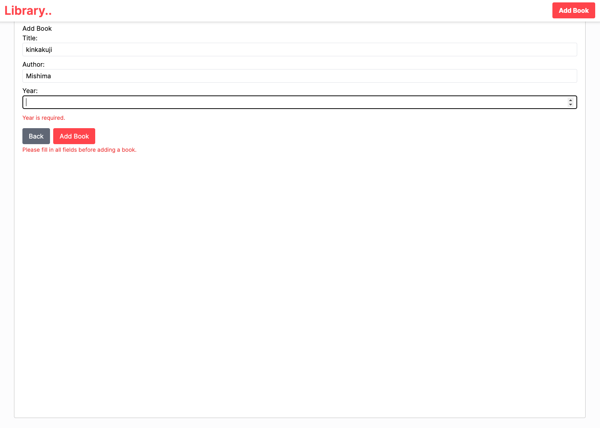
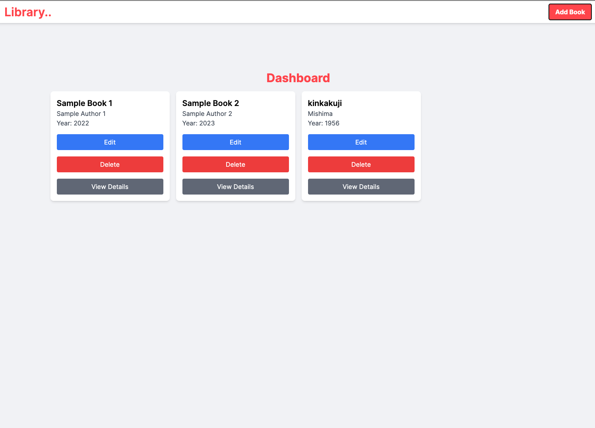
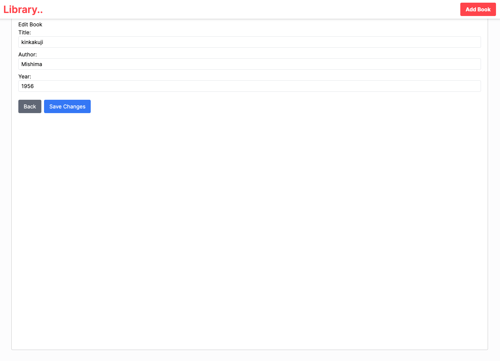
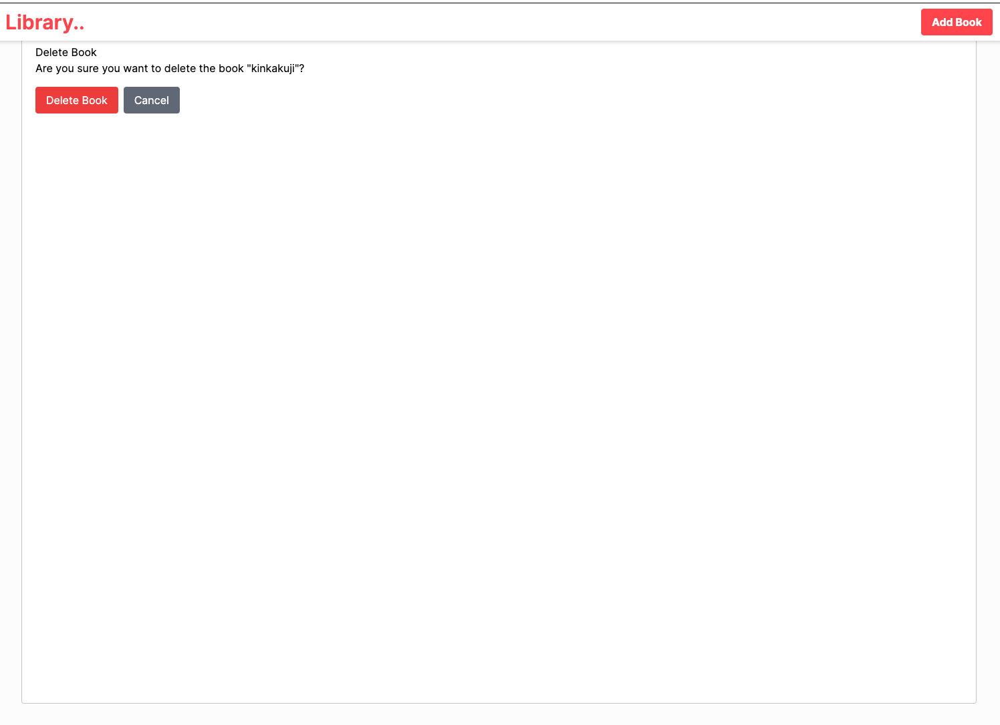

# Project Name

A simple CRUD library management application.

## Table of Contents

- [Introduction](#introduction)
- [Features](#features)
- [Technologies Used](#technologies-used)
- [Setup Instructions](#setup-instructions)
- [Usage](#usage)
  - [Dashboard Usage](#dashboard-usage)
- [API Endpoints](#api-endpoints)
- [Testing](#testing)

## Introduction

This project is a full CRUD application for managing a library of books.

## Features

- Add, edit, view, and delete books from the library.
- Interactive API documentation using Swagger.
- Frontend built with Next.js and TypeScript.
- Backend API implemented in GoLang.

## Technologies Used

- Next.js
- TypeScript
- GoLang
- PostgreSQL
- Swagger

## Setup Instructions

### Clone the repository
git clone https://github.com/your/repository.git
cd repository

### Install backend dependencies
cd backend
go mod tidy

### Install frontend dependencies
cd ../frontend
npm install

### Set up your environment variables
PORT=8080
DB_HOST=localhost
DB_USER=<USERNAME>
DB_PASSWORD=<PASSWORD>
DB_NAME=library
DB_PORT=5432
DB_SSLMODE=disable

# Database Setup

### Create the database and tables
psql -h <DB_HOST> -U <DB_USER> -d <DB_NAME> -p <DB_PORT> -f backend/db.sql/db_creation.sql

### Seed the 'books' table
psql -h <DB_HOST> -U <DB_USER> -d <DB_NAME> -p <DB_PORT> -f backend/db.sql/seed_books.sql

### Start the Backend Server
CompileDaemon -command="./gocrudapi"

### Start the Frontend Server
npm run dev

## Usage

Your interactive API documentation is here 
http://localhost:8080/docs

On the cliant side select Add to ad a new book. fill in the form and create a new book as you can see in the dashboard.

You can also edit this books parameters through another form

as well as delete this book all together. 

## API Endpoints

API documentation is here
http://localhost:8080/docs

## Testing

To run tests for the backend API, follow these steps:

1. Navigate to the backend directory:
   cd backend

2. Run
    go test

## Testing URL Cleanup and Redirection Service
Use this POST endpoint with the provided Json body to return a cleaned URL
Postman is reccomended for this test.
http://localhost:8080/process-url/

###TEST 1
REQUEST:
{
     "url": "https://BYFOOD.com/food-EXPeriences?query=abc/",
     "operation": "all"
}

RESPONSE:
{
    "processed_url": "https://www.byfood.com/food-experiences"
}

###Test 2

REQUEST
{
     "url": "https://BYFOOD.com/food-EXPeriences?query=abc/",
     "operation": "canonical"
}

RESPONSE
{
     "processed_url": "https://BYFOOD.com/food-EXPeriences"
}
